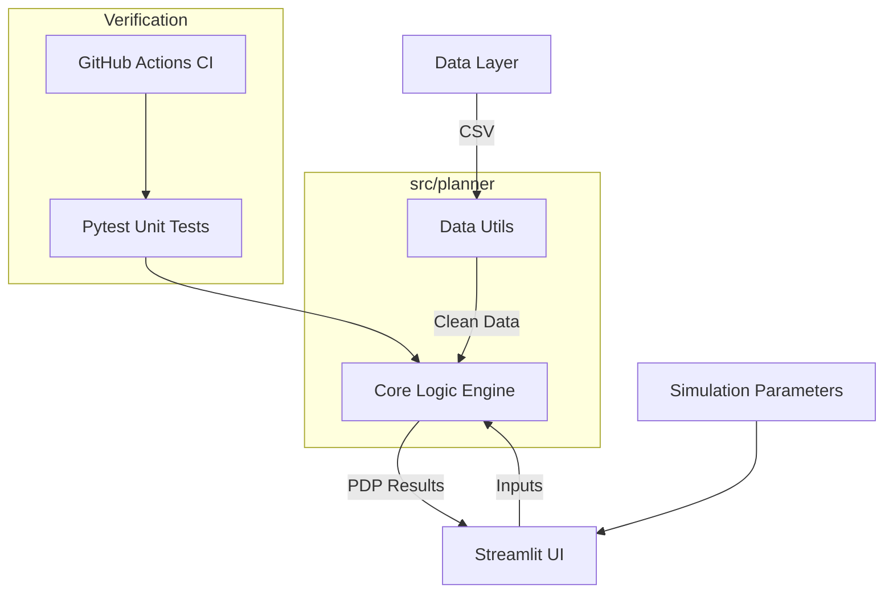

# 🌾 Ikel AI Planner - Grain d'Or

[](https://github.com/mouheb/AI-Driven-Manufacturing-Planning-hackaton/actions)
[](https://share.streamlit.io/)

**Ikel AI Planner** is an advanced manufacturing coordination tool designed to optimize production planning for the "Grain d'Or" product line. It leverages mathematical modeling to ensure maximum customer satisfaction while managing machine constraints and operational complexities.

---

## 🚀 Key Features

### 📊 Phase 1: Intelligent Planning
- **Automated PDP Generation**: Weekly Production Distribution Plan based on demand forecasts.
- **Strategic Prioritization**: Products are prioritized based on revenue (CA) to maximize profitability during capacity shortages.
- **Operational Constraints**: Accounts for machine-specific formats (WOLF vs ROVEMA).
- **CIP (Cleaning In Place) Logic**: Automatically factors in 8 hours of downtime whenever a machine switches between different perfumes.

### 🛠️ Phase 2: Resilience & Simulation
- **Machine Failure Simulation**: Test the impact of unplanned downtimes (days) on your production targets.
- **Dynamic KPIs**: Real-time tracking of:
    - **Satisfaction Rate**: (Produced Qty / Forecasted Qty).
    - **Total Revenue**: Estimated turnover based on production.
    - **Efficiency Metrics**: Visualization of cleaning downtimes.
- **Satisfaction Guardrail**: Visual alerts if the average satisfaction drops below the critical **98%** threshold.

---

## 🏗️ Project Architecture

The system is built with a modular, scalable architecture following software engineering best practices.



### 📁 Directory Structure
- `src/planner/engine.py`: The mathematical "brain" of the application.
- `src/planner/utils.py`: Data ingestion and preprocessing utility.
- `app.py`: Interactive Streamlit dashboard.
- `data/`: CSV datasets (Demand, Capacity, Prices).
- `tests/`: Automated unit tests for logic validation.
- `.github/workflows/`: CI/CD pipeline for robust deployment.

---

## 🛠️ Technology Stack
- **Language**: Python 3.10+
- **Frontend/UI**: Streamlit
- **Data Engineering**: Pandas
- **Testing**: Pytest
- **DevOps**: GitHub Actions

---

## ⚙️ Installation & Setup

1. **Clone the repository**
2. **Setup virtual environment:**
   ```powershell
   python -m venv venv
   .\venv\Scripts\Activate
   pip install -r requirements.txt
   ```

## 🏃 Running the Application

To launch the dashboard:
```powershell
.\venv\Scripts\streamlit run app.py
```

## 🧪 Robustness & Verification

The project includes a suite of automated tests to ensure the reliability of the planning engine.

```powershell
.\venv\Scripts\python -m pytest tests/
```

---

## 📈 KPIs Explained
| KPI | Description | Target |
|-----|-------------|--------|
| **Taux de Satisfaction** | Ratio of produced units vs predicted demand. | **> 98.0%** |
| **Revenue (DT)** | Estimated gross income from produced quantities. | MAX |
| **CIP Downtime** | Technical time lost due to flavor changes (8h/change). | MIN |

---
*Developed for the DHIA AI Hackathon.*
